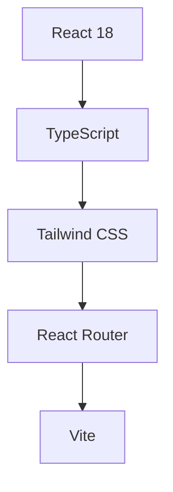

# 🚀 Next-Gen Digital Portfolio

> *"Where creativity meets technology in a symphony of digital innovation"*

## 🌌 Overview

Welcome to the future of digital portfolios. This project represents a cutting-edge fusion of modern web technologies and creative design, crafted to showcase a diverse range of digital expertise in an immersive, interactive environment.


## ⚡ Core Technologies



## 🎮 Interactive Features

### 🎯 Multi-Dimensional Portfolio Sections
- **Code Matrix** - Showcasing programming prowess
- **Media Nexus** - A gallery of multimedia masterpieces
- **VFX Universe** - Visual effects and motion graphics
- **UX/UI Lab** - Interface design innovations
- **3D Dimension** - Three-dimensional modeling and animation

### 🎨 Design Elements
- Quantum-responsive layouts
- Neural network-inspired navigation
- Holographic UI transitions
- Cyberpunk-inspired color schemes
- Dynamic content loading

## 🛠️ Tech Arsenal

| Category | Technologies |
|----------|-------------|
| Frontend | React 18, TypeScript |
| Styling | Tailwind CSS |
| Routing | React Router |
| Icons | React Icons |
| Build | Vite |

## 🚀 Quick Start

```bash
# Clone the repository
git clone [your-repository-url]

# Navigate to project directory
cd portfolio

# Install dependencies
npm install

# Launch development server
npm run dev

# Build for production
npm run build
```

## 📁 Project Architecture

```
src/
├── assets/         # Digital assets repository
├── components/     # Modular UI components
├── Pages/         # Main viewport components
├── Partials/      # Structural components
└── sections/      # Content modules
```

## 🌟 Future Enhancements

- [ ] Neural network-powered content recommendations
- [ ] AR/VR integration for immersive project viewing
- [ ] Real-time collaboration features
- [ ] AI-driven content optimization
- [ ] Blockchain-based project verification

## 🤝 Contributing

Join the evolution! Contributions are welcome through:
- Pull requests
- Issue reporting
- Feature suggestions
- Documentation improvements

## 📜 License

This project operates under the [MIT License](LICENSE) - empowering innovation and collaboration.

## 📡 Connect

- **Creator**: [Your Name]
- **Digital Presence**: [Your Email]
- **Repository**: [Your Repository URL]
- **LinkedIn**: [Your LinkedIn]
- **Portfolio**: [Your Portfolio URL]

---

<div align="center">
  <sub>Built with ❤️ and powered by the future of web development</sub>
</div>
