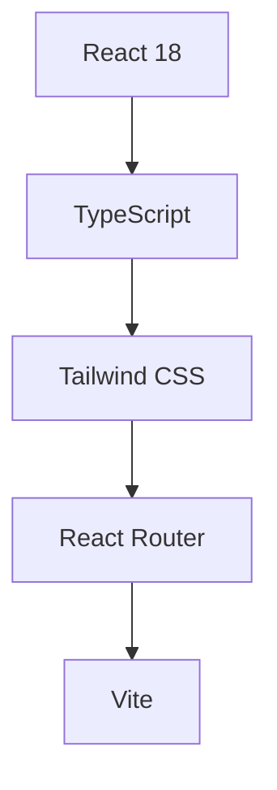

# 🚀 Next-Gen Digital Portfolio

> *"Where creativity meets technology in a symphony of digital innovation"*

## 🌌 Overview

Welcome to the future of digital portfolios. This project represents a cutting-edge fusion of modern web technologies and creative design, crafted to showcase a diverse range of digital expertise in an immersive, interactive environment.

## ⚡ Core Technologies

## 🎮 Interactive Features

### 🎯 Multi-Dimensional Portfolio Sections
- **Code Matrix** - Showcasing programming prowess
- **Media Nexus** - A gallery of multimedia masterpieces
- **VFX Universe** - Visual effects and motion graphics
- **UX/UI Lab** - Interface design innovations
- **3D Dimension** - Three-dimensional modeling and animation

### 🎨 Design Elements
- Quantum-responsive layouts
- Neural network-inspired navigation
- Holographic UI transitions
- Cyberpunk-inspired color schemes
- Dynamic content loading

## 🛠️ Tech Arsenal

| Category | Technologies |
|----------|-------------|
| Frontend | React 18, TypeScript |
| Styling | Tailwind CSS |
| Routing | React Router |
| Icons | React Icons |
| Build | Vite |

